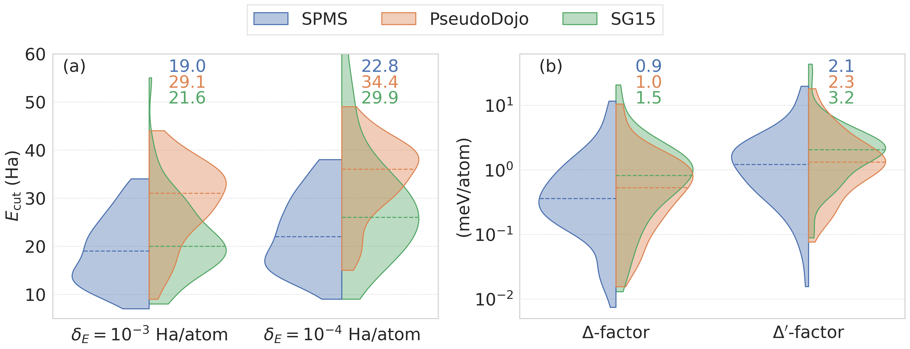

# SPMS table of pseudopotentials

|&nbsp;&nbsp;&nbsp;&nbsp;&nbsp;&nbsp;&nbsp;&nbsp;&nbsp;&nbsp;&nbsp;|&nbsp;&nbsp;&nbsp;&nbsp;&nbsp;&nbsp;&nbsp;&nbsp;&nbsp;&nbsp;&nbsp;|&nbsp;&nbsp;&nbsp;&nbsp;&nbsp;&nbsp;&nbsp;&nbsp;&nbsp;&nbsp;&nbsp;|&nbsp;&nbsp;&nbsp;&nbsp;&nbsp;&nbsp;&nbsp;&nbsp;&nbsp;&nbsp;&nbsp;|&nbsp;&nbsp;&nbsp;&nbsp;&nbsp;&nbsp;&nbsp;&nbsp;&nbsp;&nbsp;&nbsp;|&nbsp;&nbsp;&nbsp;&nbsp;&nbsp;&nbsp;&nbsp;&nbsp;&nbsp;&nbsp;&nbsp;|&nbsp;&nbsp;&nbsp;&nbsp;&nbsp;&nbsp;&nbsp;&nbsp;&nbsp;&nbsp;&nbsp;|&nbsp;&nbsp;&nbsp;&nbsp;&nbsp;&nbsp;&nbsp;&nbsp;&nbsp;&nbsp;&nbsp;|&nbsp;&nbsp;&nbsp;&nbsp;&nbsp;&nbsp;&nbsp;&nbsp;&nbsp;&nbsp;&nbsp;|&nbsp;&nbsp;&nbsp;&nbsp;&nbsp;&nbsp;&nbsp;&nbsp;&nbsp;&nbsp;&nbsp;|&nbsp;&nbsp;&nbsp;&nbsp;&nbsp;&nbsp;&nbsp;&nbsp;&nbsp;&nbsp;&nbsp;|&nbsp;&nbsp;&nbsp;&nbsp;&nbsp;&nbsp;&nbsp;&nbsp;&nbsp;&nbsp;&nbsp;|&nbsp;&nbsp;&nbsp;&nbsp;&nbsp;&nbsp;&nbsp;&nbsp;&nbsp;&nbsp;&nbsp;|&nbsp;&nbsp;&nbsp;&nbsp;&nbsp;&nbsp;&nbsp;&nbsp;&nbsp;&nbsp;&nbsp;|&nbsp;&nbsp;&nbsp;&nbsp;&nbsp;&nbsp;&nbsp;&nbsp;&nbsp;&nbsp;&nbsp;|&nbsp;&nbsp;&nbsp;&nbsp;&nbsp;&nbsp;&nbsp;&nbsp;&nbsp;&nbsp;&nbsp;|&nbsp;&nbsp;&nbsp;&nbsp;&nbsp;&nbsp;&nbsp;&nbsp;&nbsp;&nbsp;&nbsp;|&nbsp;&nbsp;&nbsp;&nbsp;&nbsp;&nbsp;&nbsp;&nbsp;&nbsp;&nbsp;&nbsp;|
|:-:|:-:|:-:|:-:|:-:|:-:|:-:|:-:|:-:|:-:|:-:|:-:|:-:|:-:|:-:|:-:|:-:|:-:|
|[psp8](psp8/01_H_1_1.0_1.0_pbe_v1.0.psp8) [upf](upf/01_H_1_1.0_1.0_pbe_v1.0.upf) **H** `20 30`|||||||||||||||||[psp8](psp8/02_He_2_1.1_1.2_pbe_v1.0.psp8) [upf](upf/02_He_2_1.1_1.2_pbe_v1.0.upf) **He** `27 32`|
|[psp8](psp8/03_Li_3_1.6_1.6_pbe_v1.0.psp8) [upf](upf/03_Li_3_1.6_1.6_pbe_v1.0.upf) **Li** `22 26`|[psp8](psp8/04_Be_4_1.8_1.9_pbe_v1.0.psp8) [upf](upf/04_Be_4_1.8_1.9_pbe_v1.0.upf) **Be** `22 26`|||||||||||[psp8](psp8/05_B_3_1.5_1.7_pbe_n_v1.0.psp8) [upf](upf/05_B_3_1.5_1.7_pbe_n_v1.0.upf) **B** `22 29`|[psp8](psp8/06_C_4_1.2_1.2_pbe_n_v1.0.psp8) [upf](upf/06_C_4_1.2_1.2_pbe_n_v1.0.upf) **C** `31 38`|[psp8](psp8/07_N_5_1.2_1.4_pbe_n_v1.0.psp8) [upf](upf/07_N_5_1.2_1.4_pbe_n_v1.0.upf) **N** `32 38`|[psp8](psp8/08_O_6_1.2_1.4_pbe_n_v1.0.psp8) [upf](upf/08_O_6_1.2_1.4_pbe_n_v1.0.upf) **O** `34 38`|[psp8](psp8/09_F_7_1.5_1.5_pbe_n_v1.0.psp8) [upf](upf/09_F_7_1.5_1.5_pbe_n_v1.0.upf) **F** `33 37`|[psp8](psp8/10_Ne_8_1.4_1.8_pbe_v1.0.psp8) [upf](upf/10_Ne_8_1.4_1.8_pbe_v1.0.upf) **Ne** `24 28`|
|[psp8](psp8/11_Na_9_1.8_2.2_pbe_v1.0.psp8) [upf](upf/11_Na_9_1.8_2.2_pbe_v1.0.upf) **Na** `19 24`|[psp8](psp8/12_Mg_10_1.9_2.0_pbe_v1.0.psp8) [upf](upf/12_Mg_10_1.9_2.0_pbe_v1.0.upf) **Mg** `23 28`|||||||||||[psp8](psp8/13_Al_3_1.9_1.9_pbe_n_v1.0.psp8) [upf](upf/13_Al_3_1.9_1.9_pbe_n_v1.0.upf) **Al** ` 9 14`|[psp8](psp8/14_Si_4_1.9_1.9_pbe_n_v1.0.psp8) [upf](upf/14_Si_4_1.9_1.9_pbe_n_v1.0.upf) **Si** ` 9 15`|[psp8](psp8/15_P_5_1.8_1.9_pbe_n_v1.0.psp8) [upf](upf/15_P_5_1.8_1.9_pbe_n_v1.0.upf) **P** `13 17`|[psp8](psp8/16_S_6_1.8_1.9_pbe_n_v1.0.psp8) [upf](upf/16_S_6_1.8_1.9_pbe_n_v1.0.upf) **S** `15 20`|[psp8](psp8/17_Cl_7_1.9_1.9_pbe_n_v1.0.psp8) [upf](upf/17_Cl_7_1.9_1.9_pbe_n_v1.0.upf) **Cl** `16 20`|[psp8](psp8/18_Ar_8_1.8_1.9_pbe_n_v1.0.psp8) [upf](upf/18_Ar_8_1.8_1.9_pbe_n_v1.0.upf) **Ar** `14 19`|
|[psp8](psp8/19_K_9_2.2_2.7_pbe_n_v1.0.psp8) [upf](upf/19_K_9_2.2_2.7_pbe_n_v1.0.upf) **K** `11 13`|[psp8](psp8/20_Ca_10_2.3_2.7_pbe_n_v1.0.psp8) [upf](upf/20_Ca_10_2.3_2.7_pbe_n_v1.0.upf) **Ca** `13 16`|[psp8](psp8/21_Sc_11_2.4_2.5_pbe_n_v1.0.psp8) [upf](upf/21_Sc_11_2.4_2.5_pbe_n_v1.0.upf) **Sc** `17 20`|[psp8](psp8/22_Ti_12_2.0_2.8_pbe_n_v1.0.psp8) [upf](upf/22_Ti_12_2.0_2.8_pbe_n_v1.0.upf) **Ti** `23 26`|[psp8](psp8/23_V_13_1.6_1.9_pbe_n_v1.0.psp8) [upf](upf/23_V_13_1.6_1.9_pbe_n_v1.0.upf) **V** `27 31`|[psp8](psp8/24_Cr_14_1.7_2.1_pbe_n_v1.0.psp8) [upf](upf/24_Cr_14_1.7_2.1_pbe_n_v1.0.upf) **Cr** `27 32`|[psp8](psp8/25_Mn_15_1.8_2.3_pbe_n_v1.0.psp8) [upf](upf/25_Mn_15_1.8_2.3_pbe_n_v1.0.upf) **Mn** `33 37`|[psp8](psp8/26_Fe_16_2.0_2.5_pbe_n_v1.0.psp8) [upf](upf/26_Fe_16_2.0_2.5_pbe_n_v1.0.upf) **Fe** `25 32`|[psp8](psp8/27_Co_17_1.6_2.2_pbe_n_v1.0.psp8) [upf](upf/27_Co_17_1.6_2.2_pbe_n_v1.0.upf) **Co** `26 31`|[psp8](psp8/28_Ni_18_1.7_2.2_pbe_n_v1.0.psp8) [upf](upf/28_Ni_18_1.7_2.2_pbe_n_v1.0.upf) **Ni** `29 34`|[psp8](psp8/29_Cu_19_1.7_1.9_pbe_n_v1.0.psp8) [upf](upf/29_Cu_19_1.7_1.9_pbe_n_v1.0.upf) **Cu** `32 35`|[psp8](psp8/30_Zn_20_1.9_2.3_pbe_n_v1.0.psp8) [upf](upf/30_Zn_20_1.9_2.3_pbe_n_v1.0.upf) **Zn** `27 30`|[psp8](psp8/31_Ga_13_1.9_2.4_pbe_n_v1.0.psp8) [upf](upf/31_Ga_13_1.9_2.4_pbe_n_v1.0.upf) **Ga** `29 34`|[psp8](psp8/32_Ge_14_2.2_2.3_pbe_n_v1.0.psp8) [upf](upf/32_Ge_14_2.2_2.3_pbe_n_v1.0.upf) **Ge** `22 25`|[psp8](psp8/33_As_15_1.8_2.1_pbe_n_v1.0.psp8) [upf](upf/33_As_15_1.8_2.1_pbe_n_v1.0.upf) **As** `27 30`|[psp8](psp8/34_Se_16_1.9_2.1_pbe_n_v1.0.psp8) [upf](upf/34_Se_16_1.9_2.1_pbe_n_v1.0.upf) **Se** `27 30`|[psp8](psp8/35_Br_7_2.1_2.2_pbe_n_v1.0.psp8) [upf](upf/35_Br_7_2.1_2.2_pbe_n_v1.0.upf) **Br** `11 14`|[psp8](psp8/36_Kr_8_1.7_2.3_pbe_n_v1.0.psp8) [upf](upf/36_Kr_8_1.7_2.3_pbe_n_v1.0.upf) **Kr** `19 22`|
|[psp8](psp8/37_Rb_9_2.8_3.3_pbe_n_v1.0.psp8) [upf](upf/37_Rb_9_2.8_3.3_pbe_n_v1.0.upf) **Rb** ` 7  9`|[psp8](psp8/38_Sr_10_2.3_2.5_pbe_n_v1.0.psp8) [upf](upf/38_Sr_10_2.3_2.5_pbe_n_v1.0.upf) **Sr** `10 13`|[psp8](psp8/39_Y_11_2.1_2.4_pbe_n_v1.0.psp8) [upf](upf/39_Y_11_2.1_2.4_pbe_n_v1.0.upf) **Y** `13 16`|[psp8](psp8/40_Zr_12_2.0_2.5_pbe_n_v1.0.psp8) [upf](upf/40_Zr_12_2.0_2.5_pbe_n_v1.0.upf) **Zr** `13 17`|[psp8](psp8/41_Nb_13_1.5_1.7_pbe_n_v1.0.psp8) [upf](upf/41_Nb_13_1.5_1.7_pbe_n_v1.0.upf) **Nb** `24 28`|[psp8](psp8/42_Mo_14_2.0_2.6_pbe_n_v1.0.psp8) [upf](upf/42_Mo_14_2.0_2.6_pbe_n_v1.0.upf) **Mo** `19 23`|[psp8](psp8/43_Tc_15_2.4_2.8_pbe_n_v1.0.psp8) [upf](upf/43_Tc_15_2.4_2.8_pbe_n_v1.0.upf) **Tc** `12 14`|[psp8](psp8/44_Ru_16_2.3_2.5_pbe_n_v1.0.psp8) [upf](upf/44_Ru_16_2.3_2.5_pbe_n_v1.0.upf) **Ru** `19 24`|[psp8](psp8/45_Rh_17_1.9_2.4_pbe_n_v1.0.psp8) [upf](upf/45_Rh_17_1.9_2.4_pbe_n_v1.0.upf) **Rh** `21 25`|[psp8](psp8/46_Pd_18_1.9_2.2_pbe_n_v1.0.psp8) [upf](upf/46_Pd_18_1.9_2.2_pbe_n_v1.0.upf) **Pd** `21 24`|[psp8](psp8/47_Ag_19_1.9_2.5_pbe_n_v1.0.psp8) [upf](upf/47_Ag_19_1.9_2.5_pbe_n_v1.0.upf) **Ag** `18 22`|[psp8](psp8/48_Cd_20_2.2_2.3_pbe_n_v1.0.psp8) [upf](upf/48_Cd_20_2.2_2.3_pbe_n_v1.0.upf) **Cd** `19 24`|[psp8](psp8/49_In_13_2.5_3.1_pbe_n_v1.0.psp8) [upf](upf/49_In_13_2.5_3.1_pbe_n_v1.0.upf) **In** `17 20`|[psp8](psp8/50_Sn_14_2.5_3.0_pbe_n_v1.0.psp8) [upf](upf/50_Sn_14_2.5_3.0_pbe_n_v1.0.upf) **Sn** `16 18`|[psp8](psp8/51_Sb_15_2.3_2.4_pbe_n_v1.0.psp8) [upf](upf/51_Sb_15_2.3_2.4_pbe_n_v1.0.upf) **Sb** `22 24`|[psp8](psp8/52_Te_16_2.3_2.3_pbe_n_v1.0.psp8) [upf](upf/52_Te_16_2.3_2.3_pbe_n_v1.0.upf) **Te** `22 25`|[psp8](psp8/53_I_7_2.3_2.5_pbe_n_v1.0.psp8) [upf](upf/53_I_7_2.3_2.5_pbe_n_v1.0.upf) **I** ` 9 14`|[psp8](psp8/54_Xe_8_2.5_2.5_pbe_n_v1.0.psp8) [upf](upf/54_Xe_8_2.5_2.5_pbe_n_v1.0.upf) **Xe** `10 12`|
|[psp8](psp8/55_Cs_9_2.2_2.5_pbe_n_v1.0.psp8) [upf](upf/55_Cs_9_2.2_2.5_pbe_n_v1.0.upf) **Cs** `13 15`|[psp8](psp8/56_Ba_10_2.8_2.8_pbe_n_v1.0.psp8) [upf](upf/56_Ba_10_2.8_2.8_pbe_n_v1.0.upf) **Ba** ` 8 11`|[psp8](psp8/57_La_11_2.5_2.8_pbe_n_v1.0.psp8) [upf](upf/57_La_11_2.5_2.8_pbe_n_v1.0.upf) **La** `15 18`|[psp8](psp8/72_Hf_12_2.3_3.0_pbe_n_v1.0.psp8) [upf](upf/72_Hf_12_2.3_3.0_pbe_n_v1.0.upf) **Hf** `12 15`|[psp8](psp8/73_Ta_13_2.2_2.6_pbe_n_v1.0.psp8) [upf](upf/73_Ta_13_2.2_2.6_pbe_n_v1.0.upf) **Ta** `14 17`|[psp8](psp8/74_W_14_2.3_2.5_pbe_n_v1.0.psp8) [upf](upf/74_W_14_2.3_2.5_pbe_n_v1.0.upf) **W** `13 16`|[psp8](psp8/75_Re_15_2.4_2.6_pbe_n_v1.0.psp8) [upf](upf/75_Re_15_2.4_2.6_pbe_n_v1.0.upf) **Re** `13 16`|[psp8](psp8/76_Os_16_2.7_2.7_pbe_n_v1.0.psp8) [upf](upf/76_Os_16_2.7_2.7_pbe_n_v1.0.upf) **Os** `14 16`|[psp8](psp8/77_Ir_17_2.5_2.6_pbe_n_v1.0.psp8) [upf](upf/77_Ir_17_2.5_2.6_pbe_n_v1.0.upf) **Ir** `13 17`|[psp8](psp8/78_Pt_18_2.2_2.4_pbe_n_v1.0.psp8) [upf](upf/78_Pt_18_2.2_2.4_pbe_n_v1.0.upf) **Pt** `17 21`|[psp8](psp8/79_Au_19_2.4_2.5_pbe_n_v1.0.psp8) [upf](upf/79_Au_19_2.4_2.5_pbe_n_v1.0.upf) **Au** `16 19`|[psp8](psp8/80_Hg_20_1.9_2.5_pbe_n_v1.0.psp8) [upf](upf/80_Hg_20_1.9_2.5_pbe_n_v1.0.upf) **Hg** `20 23`|[psp8](psp8/81_Tl_13_3.0_3.2_pbe_n_v1.0.psp8) [upf](upf/81_Tl_13_3.0_3.2_pbe_n_v1.0.upf) **Tl** `12 14`|[psp8](psp8/82_Pb_14_3.0_3.1_pbe_n_v1.0.psp8) [upf](upf/82_Pb_14_3.0_3.1_pbe_n_v1.0.upf) **Pb** `12 14`|[psp8](psp8/83_Bi_15_2.4_2.8_pbe_n_v1.0.psp8) [upf](upf/83_Bi_15_2.4_2.8_pbe_n_v1.0.upf) **Bi** `14 19`||||
|||||||||||||||||||

### Brief
* Soft and transferable pseudopotentials from multi-objective optimization
* psp8 and upf formats
* Naming scheme: AtomicNumber_ChemicalElement_NumberValenceElectrons_min-rcore_max-rcore_NonlinearCoreCorrectionFlag_VersionNumber.psp8/upf
* PBE exchange-correlation functional
* Nonlinear core correction (NLCC) for most chemical elements
* Estimates of planewave cutoff (Ecut) in planewave calculations and mesh-size in real-space calculations for accuracies of 1e-3 Ha/atom and 1e-4 Ha/atom provided within the pseudopotential files
* Detailed results and comparisons for each chemical element available in [SPMS_v1.0.pdf](SPMS_v1.0.pdf)

### License
* Distributed under GNU General Public License 3 (GPL) (https://www.gnu.org/licenses/)

### Authors
* Mostafa Faghih Shojaei (GT)
* John E. Pask (LLNL)
* Andrew J. Medford (GT)
* Phanish Suryanarayana (GT, phanish.suryanarayana@ce.gatech.edu)

### Citation
* https://doi.org/10.48550/arXiv.2209.09806

### Acknowledgement
* U.S. Department of Energy (DOE), Office of Science (SC): DE-SC0019410
